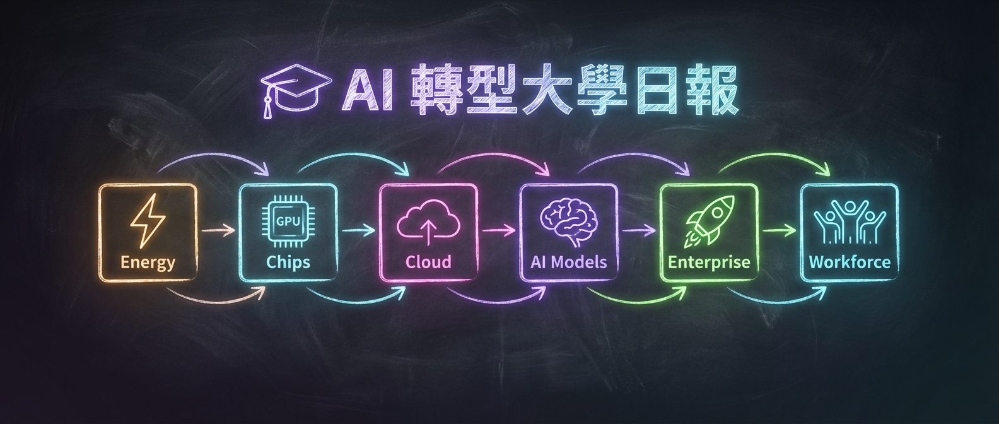

# 🎓 AI 轉型大學日報
> 生成時間：2026-02-09 08:42 | 43 個資訊來源

---

## 🔥 頭條精選 (Top 5)
> 跨層級最重要的 AI 產業動態

### 1. [Qwen3.5 PR 已開啟——下一代模型將內建視覺語言能力](https://reddit.com/r/LocalLLaMA/comments/1qz23pp/pr_opened_for_qwen35/)
📊 **r/LocalLLaMA** | 539 pts | 2026-02-08 14:57
Qwen3.5 系列模型的 HuggingFace Transformers PR 已提交，程式碼顯示將原生支援視覺語言模型（VLM）。這意味著阿里巴巴的下一代開源模型將在發布時就具備多模態能力，直接與 GPT-5.2、Claude Opus 4.6 競爭。
- 🎯 **核心觀點**：開源模型的多模態能力正加速追趕閉源前沿，VLM 成為標配而非加分項
- 💡 **產業影響**：企業可用開源多模態模型降低 API 成本，本地部署場景大幅擴展
- 🏷️ `#L4模型` `#Qwen` `#開源` `#多模態`

---

### 2. [GPT-5.3-Codex 發布：SOTA SWE-Bench Pro 57%、OSWorld 64%](https://www.producthunt.com/products/openai)
📊 **Product Hunt** | Top Product | 2026-02-05
OpenAI 發布 GPT-5.3-Codex，在 SWE-Bench Pro（57%）和 OSWorld（64%）上創下新高。該模型支援中途引導（mid-task steerability），速度比 5.2 快 25%，並且是首個「參與創造自身」的模型——早期版本被用來除錯訓練過程本身。
- 🎯 **核心觀點**：AI 編碼代理正從「輔助工具」進化為「自主開發者」，能端到端處理複雜工程任務
- 💡 **產業影響**：開發者生產力工具市場重新洗牌，企業 AI 編碼支出將加速成長
- 🏷️ `#L4模型` `#L6人才` `#OpenAI` `#Codex`

---

### 3. [Anthropic 與 OpenAI 超級盃廣告大戰——AI 產業走向主流消費者](https://www.theverge.com/entertainment/874504/super-bowl-lx-ads-big-game)
📊 **The Verge** | 2026-02-08 18:58
超級盃 LX 成為 AI 產業的分水嶺時刻：Anthropic 打出「對話中不該有廣告」攻擊 OpenAI 的廣告計畫，OpenAI 則以 Codex「你可以直接建造」反擊。Sam Altman 稱 Anthropic 廣告「明顯不誠實」，Anthropic 在播出版本中修改了措辭。
- 🎯 **核心觀點**：AI 公司首次在超級盃舞台正面交鋒，標誌 AI 從技術圈進入主流消費認知
- 💡 **產業影響**：品牌定位之爭白熱化，企業客戶將更關注 AI 供應商的商業模式與價值觀差異
- 🏷️ `#L5商業` `#Anthropic` `#OpenAI` `#品牌戰`

---

### 4. [紐約州提出兩項 AI 法案：AI 新聞標示 + 資料中心建設暫停三年](https://www.theverge.com/ai-artificial-intelligence/875501/new-york-is-considering-two-bills-to-rein-in-the-ai-industry)
📊 **The Verge** | 2026-02-08 16:04
紐約州立法機構考慮兩項法案：NY FAIR News Act 要求 AI 生成的新聞必須標示並經人工審核；S9144 則提出暫停新資料中心建設許可三年，因電力需求三倍增長、未來五年預計新增 10GW 負載。
- 🎯 **核心觀點**：AI 監管從聯邦層級擴展到州級，能源與內容兩條戰線同時推進
- 💡 **產業影響**：資料中心選址策略需重新評估，AI 內容生態的合規成本將提高
- 🏷️ `#L1能源` `#L6人才` `#監管` `#資料中心`

---

### 5. [McKinsey 將 25,000 個 AI Agent 納入「員工數」——顧問業槓桿模型正在改寫](https://www.infoai.com.tw/blog/mckinsey-ai-agents-digital-workforce-redefined)
📊 **InfoAI** | 2026-02-08
McKinsey CEO 宣布公司約 60,000 名「員工」中有 25,000 個 AI Agent，透過「25-squared」策略（面客角色增 25%、非面客縮減 25%），在搜尋與彙整類工作上省下約 150 萬小時。管理語言正式把 AI 從工具提升為「可被盤點的數位勞動單位」。
- 🎯 **核心觀點**：頂級顧問公司率先將 AI Agent 制度化為「數位員工」，工時計價模式面臨結構性挑戰
- 💡 **產業影響**：企業 AI 轉型從「導入工具」升級為「重新定義人力」，催生新的組織設計範式
- 🏷️ `#L5商業` `#L6人才` `#AIAgent` `#McKinsey`

---

## ⚡ L1: 能源與基礎設施
| 中文摘要 | 來源 | 時間 | 標題 |
|----------|------|------|------|
| 紐約州提出暫停資料中心建設三年，因電力需求暴增 10GW | The Verge | 16:04 | [New York is considering two bills to rein in the AI industry](https://www.theverge.com/ai-artificial-intelligence/875501/new-york-is-considering-two-bills-to-rein-in-the-ai-industry) |
| AI 資料中心擴張成為重大能源衝擊，電網準備好了嗎？ | r/energy | 04:41 | [The AI data center boom is becoming a major energy demand shock](https://reddit.com/r/energy/comments/1qzk6tp/the_ai_data_center_boom_is_becoming_a_major/) |
| Chamber 推出 GPU 基礎設施自動化管理平台，解決 40-60% 閒置率問題 | Product Hunt | 2026-02-03 | [Chamber: Autopilot for AI Infrastructure](https://www.producthunt.com/products/chamber-autopilot-for-ai-infrastructure) |
| MIT 教授探討 AI 如何優化電網——提升效率、增加韌性、整合再生能源 | MIT News AI | 2026-01-09 | [3 Questions: How AI could optimize the power grid](https://news.mit.edu/2026/3-questions-how-ai-could-optimize-power-grid-0109) |
| 台灣 GDP 因 AI 外需爆衝 8.63%，但壓力正往金融穩定集結 | InfoAI | 2026-02-02 | [台灣 GDP 爆衝的真相](https://www.infoai.com.tw/blog/taiwan-gdp-ai-export-financial-stability-risk) |

## 🔧 L2: 晶片與算力
| 中文摘要 | 來源 | 時間 | 標題 |
|----------|------|------|------|
| Strix Halo 雙節點叢集 RDMA 推論基準測試，展示消費級分散式 AI | r/LocalLLaMA | 03:16 | [Strix Halo Distributed Cluster benchmarks](https://reddit.com/r/LocalLLaMA/comments/1qzhxd0/strix_halo_distributed_cluster_2x_strix_halo_rdma/) |
| Oracle AI Database 26ai 正式發布 Linux 版，內建 AI 向量搜尋與 MCP 支援 | Publickey | 2026-01-28 | [オラクル、Linux版の「Oracle AI Database 26ai」正式リリース](https://www.publickey1.jp/blog/26/linuxoracle_ai_database_26ai.html) |
| iPhone 17e 將搭載 A19 晶片，Apple 積極搶攻新興市場 | The Verge | 10:26 | [The iPhone 17e could launch soon with MagSafe and an A19 chip](https://www.theverge.com/tech/875454/iphone-17e-launching-soon-magsafe-a19) |

## ☁️ L3: 雲端與平台
| 中文摘要 | 來源 | 時間 | 標題 |
|----------|------|------|------|
| Claude Opus 4.6 × Vertex AI 完全指南：在 GCP 上安全使用 Claude Code | はてなブックマーク | 2026-02-08 | [Claude Opus 4.6 × Vertex AI 完全ガイド](https://zenn.dev/google_cloud_jp/articles/b65dc4d6df7f34) |
| OpenAI 推出 Frontier 企業平台——管理 AI Agent 的身分、權限與稽核 | AI News | 10:00 | [Intuit, Uber, and State Farm trial AI agents inside enterprise workflows](https://www.artificialintelligence-news.com/news/intuit-uber-and-state-farm-trial-ai-agents-inside-enterprise-workflows/) |
| Perplexity 推出 Model Council：同時查詢多個前沿模型並綜合結果 | Product Hunt | 2026-02-05 | [Model Council in Perplexity](https://www.producthunt.com/products/perplexity-ai) |
| Cisco 打造 AI 時代智慧系統——Nexus Hyperfabric、Secure AI Factory 框架 | AI News | 10:00 | [How Cisco builds smart systems for the AI era](https://www.artificialintelligence-news.com/news/how-cisco-builds-smart-systems-for-the-ai-era/) |
| DigitalOcean 以 Gradient AI 雲端統一 GPU 基礎設施與 Agent 平台 | Dev.to | 2026-02-02 | [DigitalOcean on Dev.to: Practical AI Insights for Builders](https://dev.to/digitalocean/digitalocean-on-devto-practical-ai-insights-for-builders-3g0c) |

## 🧠 L4: AI 模型與研究
| 中文摘要 | 來源 | 時間 | 標題 |
|----------|------|------|------|
| Qwen3.5 PR 已開啟，將原生支援視覺語言模型 | r/LocalLLaMA | 14:57 | [PR opened for Qwen3.5!!](https://reddit.com/r/LocalLLaMA/comments/1qz23pp/pr_opened_for_qwen35/) |
| Qwen3 Coder Next 成為首個「可用」的 60GB 以下編碼模型 | r/LocalLLaMA | 18:43 | [Qwen3 Coder Next as first "usable" coding model < 60 GB](https://reddit.com/r/LocalLLaMA/comments/1qz5uww/qwen3_coder_next_as_first_usable_coding_model_60/) |
| MiniMax M2.2 即將發布，程式碼洩露新版本 | r/LocalLLaMA | 07:22 | [MiniMax M2.2 Coming Soon!](https://reddit.com/r/LocalLLaMA/comments/1qzo77z/minimax_m22_coming_soon/) |
| DeepSeek 時刻一週年：中國開源 AI 生態三部曲分析 | HuggingFace Blog | 2026-01-20 | [One Year Since the "DeepSeek Moment"](https://huggingface.co/blog/huggingface/one-year-since-the-deepseek-moment) |
| 中國開源 AI 生態架構選擇：MoE 成為預設、多模態平行推進 | HuggingFace Blog | 2026-01-27 | [Architectural Choices in China's Open-Source AI Ecosystem](https://huggingface.co/blog/huggingface/one-year-since-the-deepseek-moment-blog-2) |
| Claude 教開源模型寫 CUDA Kernel——Agent Skill 跨模型遷移 | HuggingFace Blog | 2026-01-28 | [We Got Claude to Build CUDA Kernels and teach open models!](https://huggingface.co/blog/upskill) |
| Differential Transformer V2：更快推論、更穩訓練的注意力機制改進 | HuggingFace Blog | 2026-01-20 | [Differential Transformer V2](https://huggingface.co/blog/microsoft/diff-attn-v2) |
| MIT EnCompass：分離邏輯與搜尋提升 AI Agent 可擴展性 | AI News | 11:32 | [How separating logic and search boosts AI agent scalability](https://www.artificialintelligence-news.com/news/how-separating-logic-and-search-boosts-ai-agent-scalability/) |
| MIT 研究：生成式 AI 指導科學家合成複雜材料 | MIT News AI | 2026-02-02 | [How generative AI can help scientists synthesize complex materials](https://news.mit.edu/2026/how-generative-ai-can-help-scientists-synthesize-complex-materials-0202) |
| MIT 開發 EnCompass 幫助 AI Agent 搜尋 LLM 最佳輸出 | MIT News AI | 2026-02-05 | [Helping AI agents search to get the best results out of LLMs](https://news.mit.edu/2026/helping-ai-agents-search-to-get-best-results-from-llms-0205) |
| LinkedIn 解鎖 GPT-OSS 的 Agentic RL 訓練 | HuggingFace Blog | 2026-01-27 | [Unlocking Agentic RL Training for GPT-OSS](https://huggingface.co/blog/LinkedIn/gpt-oss-agentic-rl) |
| Microsoft 揭露偵測 LLM「沉睡代理人」後門的掃描方法 | AI News | 10:43 | [Microsoft unveils method to detect sleeper agent backdoors](https://www.artificialintelligence-news.com/news/microsoft-unveils-method-detect-sleeper-agent-backdoors/) |
| 推理模式 vs 非推理模式基準對比：差距可達 5 倍 | r/LocalLLaMA | 07:00 | [Comparing the same model with reasoning turned on and off](https://reddit.com/r/LocalLLaMA/comments/1qznps2/comparing_the_same_model_with_reasoning_turned_on/) |
| CRISPR-PAMdb + CICERO：用機器學習預測 Cas9 PAM 偏好 | Nature Comms | 2026-02-08 | [Uncovering Cas9 PAM diversity through metagenomic mining and ML](https://www.nature.com/articles/s41467-026-69098-5) |
| 日本開發者打造 AI Agent yagi：支援 15 種 LLM 供應商的 CLI 工具 | Zenn | 2026-02-07 | [AI Agent yagi を作った](https://zenn.dev/mattn/articles/af6b456142dafe) |

## 🚀 L5: 商業應用與新創
| 中文摘要 | 來源 | 時間 | 標題 |
|----------|------|------|------|
| AI 法律代理人可能成真？Opus 4.6 在 APEX-Agents 法律基準跳升至 29.8% | TechCrunch | 20:26 | [Maybe AI agents can be lawyers after all](https://techcrunch.com/2026/02/06/maybe-ai-agents-can-be-lawyers-after-all/) |
| 「AI 律師」不是突然出現——法律工作被拆成可交付的流程段 | InfoAI | 2026-02-08 | [精選解讀｜「AI 律師」沒有突然出現](https://www.infoai.com.tw/blog/ai-legal-workflows-responsibility-audit-traceability) |
| OpenAI 把 AI 代理人拉到「平台層」：企業買的是「管得住」 | InfoAI | 2026-02-06 | [OpenAI 把 AI 代理人拉到「平台層」](https://www.infoai.com.tw/blog/openai-frontier-agent-governance-platform-enterprise-control) |
| Shannon 自主 AI 滲透測試工具：XBOW 基準達 96.15% 成功率 | GitHub Trending | Today | [KeygraphHQ/shannon](https://github.com/KeygraphHQ/shannon) |
| Dexter：自主金融研究代理人，支援任務規劃與自我驗證 | GitHub Trending | Today | [virattt/dexter](https://github.com/virattt/dexter) |
| Pydantic Monty：Rust 寫的安全 Python 直譯器，專為 AI Agent 設計 | GitHub Trending | Today | [pydantic/monty](https://github.com/pydantic/monty) |
| 博弘雲端 AI 系統整合商：HAPPY GO 廣告點擊轉換率提升 50% | 數位時代 | 2026-01-30 | [從智慧助手到自主代理](https://www.bnext.com.tw/article/89928/nextlinkcloud202601) |
| 微軟推出「出版商內容市集」試辦——AI 引用內容可授權交易 | InfoAI | 2026-02-08 | [微軟推出「出版商內容市集」試辦](https://www.infoai.com.tw/blog/microsoft-publisher-content-marketplace-ai-licensing-experiment) |
| 「沒產品、沒營收」也能成獨角獸——AI 研究型新創改寫募資規則 | InfoAI | 2026-02-02 | [「沒產品、沒營收」也能成獨角獸](https://www.infoai.com.tw/blog/ai-research-startups-funding-without-products) |
| RentAHuman.ai：AI Agent 可租用真人執行現實世界任務 | Product Hunt | 2026-02-05 | [RentAHuman.ai](https://www.producthunt.com/products/rentahuman-ai) |
| V2EX 爆文：花 3 萬美元和 4 個月開發 Agent 網頁監控工具 coolvibe.io | V2EX | Hot | [花 4 个月和 3 万刀做了个 Agent 网页支持工具](https://www.v2ex.com/t/1191528) |
| 華爾街見聞：AI、機器人春節大戰，本週重磅日程 | Wall Street CN | 08:12 | [本周重磅日程：AI、機器人春節大戰](https://wallstreetcn.com/articles/3765243) |

## 👥 L6: 人才與生產力
| 中文摘要 | 來源 | 時間 | 標題 |
|----------|------|------|------|
| McKinsey 25,000 AI Agent 納入員工數，顧問業金字塔養成路徑需重畫 | InfoAI | 2026-02-08 | [McKinsey 的「25,000 AI Agents」不是噱頭](https://www.infoai.com.tw/blog/mckinsey-ai-agents-digital-workforce-redefined) |
| GPT-4o 退役風波：情感依附已成平台風險 | InfoAI | 2026-02-08 | [GPT-4o 退役風波揭露的不是模型更替](https://www.infoai.com.tw/blog/gpt-4o-retirement-emotional-attachment-platform-risk) |
| AI 不是搶你的工作——是搶走你的幻覺 | Dev.to | 2026-02-03 | [AI isn't taking our jobs — It's taking our illusions](https://dev.to/igbominadeveloper/ai-isnt-take-our-jobs-its-taking-our-illusions-138j) |
| 把行政後勤 AI 化：差別不在工具，在你把什麼工作交出去 | InfoAI | 2026-02-06 | [把行政後勤 AI 化](https://www.infoai.com.tw/blog/back-office-ai-from-digitization-to-governed-digital-labor) |
| OpenAI 企業推進：招募大量 AI 顧問填補導入落差 | AI News | 08:00 | [OpenAI's enterprise push: The hidden story behind AI's sales race](https://www.artificialintelligence-news.com/news/openai-ai-consultants-enterprise-adoption-challenges/) |
| AI Expo 2026：從實驗試點到 AI 生產的治理與資料準備 | AI News | 16:33 | [AI Expo 2026 Day 1: Governance and data readiness](https://www.artificialintelligence-news.com/news/ai-expo-2026-day-1-governance-data-readiness-enable-agentic-enterprise/) |
| Google AI 影片理解實作指南：Gemini 3.0 Flash 用於機器人任務分解 | Dev.to | 2026-02-05 | [Video Understanding with Gemini 3.0 Flash for Robotics](https://dev.to/googleai/video-understanding-with-gemini-30-flash-for-robotics-5896) |
| Agent Factory 回顧：解析開源 Agentic 模型的訓練全流程 | Dev.to | 2026-02-06 | [Agent Factory Recap: Cracking Open an Open Model](https://dev.to/googleai/agent-factory-recap-cracking-open-an-open-model-42e6) |
| MIT 新課程「AI 與理性」：哲學角度審視 AI 決策的理性基礎 | MIT News AI | 2026-01-30 | [The philosophical puzzle of rational AI](https://news.mit.edu/2026/philosophical-puzzle-rational-artificial-intelligence-0130) |
| V2EX 熱議：AI 寫程式已經像「薩滿跳大神」——Vibe Coding 時代的身分危機 | V2EX | Hot | [为什么 AI 就这么聪明了](https://www.v2ex.com/t/1191488) |
| Waypoint-1：Overworld 推出即時互動影片擴散模型，可用鍵鼠控制 | HuggingFace Blog | 2026-01-20 | [Introducing Waypoint-1: Real-time interactive video diffusion](https://huggingface.co/blog/waypoint-1) |
| HuggingFace Daggr：視覺化串接 AI 工作流的 Python 套件 | HuggingFace Blog | 2026-01-29 | [Introducing Daggr: Chain apps programmatically, inspect visually](https://huggingface.co/blog/daggr) |
