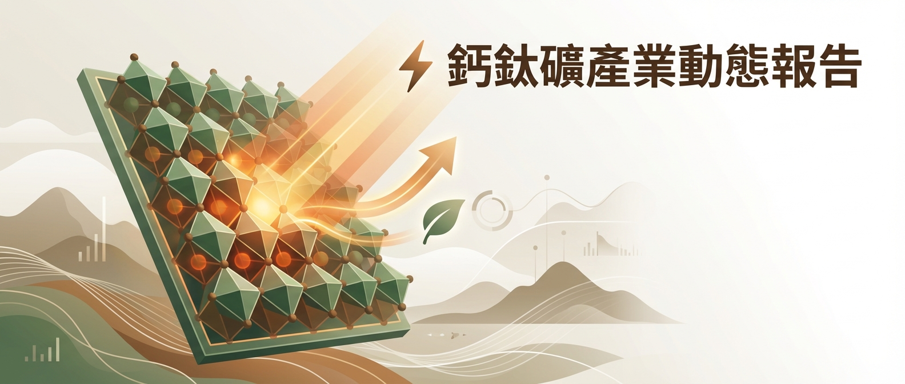

# ⚡ 鈣鈦礦產業動態報告
> 生成時間：2026-02-07 15:29 | 主題：鈣鈦礦太陽能電池產業

---

## 🔬 重點突破 (Top 5)
> 最重要的技術突破、產業動態、政策變化

### 1. [Trinasolar 創 32.6% 串聯電池效率新紀錄，3.1m² 模組達 865W](https://www.trinasolar.com/us/resources/newsroom/Trinasolar-Sets-Tandem-Cell-Efficiency-and-Module-Power-Output-Records/)
📊 **Trina Solar** | 2026-01-26

Trinasolar 與懷柔實驗室合作，在 210mm 半切鈣鈦礦/晶矽串聯電池上達成 32.6% 效率（Fraunhofer ISE CalLab 認證），3.1m² 工業標準尺寸串聯模組峰值功率 865W（TÜV SÜD 認證），雙雙刷新世界紀錄。

- 🎯 **技術重點**：工業級大面積串聯電池效率突破，模組功率創新高
- 💡 **產業影響**：展示鈣鈦礦/晶矽串聯技術從實驗室走向工業製造的可行性，加速商業化進程
- 🏷️ `#鈣鈦礦` `#串聯電池` `#Trinasolar` `#世界紀錄`

### 2. [Nature Energy：全鈣鈦礦串聯電池達 30.19% 效率（認證 29.38%）](https://www.nature.com/articles/s41560-026-01964-4)
📊 **Nature Energy** | 2026-02-04

研究團隊設計雙咔唑基二聚體結構，形成氫鍵網路自組裝單分子層（SAM），實現 1.77 eV PSC 效率 21.56%、1.56 eV PSC 效率 26.80%（認證 26.57%），全鈣鈦礦串聯電池效率 30.19%（認證 29.38%，穩態 28.40%）。

- 🎯 **技術重點**：氫鍵網路 SAM 電洞傳輸層設計，開路電壓 1.35V，填充因子 85.76%
- 💡 **產業影響**：全鈣鈦礦串聯架構效率持續逼近 30% 大關，為低成本高效率路線提供新方案
- 🏷️ `#全鈣鈦礦串聯` `#SAM` `#30%效率`

### 3. [Nature Energy：2D/3D 異質結構鈣鈦礦太陽能電池達 26.19% 效率](https://www.nature.com/articles/s41560-026-01980-4)
📊 **Nature Energy** | 2026-02-06

透過固態配體交換反應，在 SnO₂ 奈米粒子上接枝硫代乙醇酸與油胺，僅在埋層介面形成 2D/3D 異質結構。缺陷濃度降低十倍以上，小面積效率 26.19%（認證 26.04%），21.54 cm² 效率 23.44%（認證 22.68%），64.80 cm² 效率 22.22%。

- 🎯 **技術重點**：選擇性埋層介面 2D 相工程、十倍缺陷降低
- 💡 **產業影響**：大面積（64.80 cm²）仍維持 22%+ 效率，展示從小面積到模組級的放大潛力
- 🏷️ `#鈣鈦礦` `#2D/3D異質結構` `#大面積`

### 4. [SolaEon 宣布單接面鈣鈦礦電池 27.87% 效率紀錄](https://www.perovskite-info.com/solaeon-reports-2787-efficiency-single-junction-perovskite-solar-cell)
📊 **Perovskite-Info** | 2026-01-30

SolaEon 宣布 0.076 cm² 單接面鈣鈦礦電池達 27.87%（NPVM 認證），填充因子 87.61%。此前該公司已報告全鈣鈦礦串聯 >31%，大面積模組（0.72 m²）全面積效率 20.7%，穩態 25.27%。

- 🎯 **技術重點**：單接面鈣鈦礦效率不斷逼近 33% 理論極限
- 💡 **產業影響**：中國企業在鈣鈦礦效率競賽中持續領跑，加速產業化信心
- 🏷️ `#鈣鈦礦` `#效率紀錄` `#SolaEon`

### 5. [鈣鈦礦太陽能面板在西藏高原供電公廁，800 片面板 + 199 套儲能](https://www.perovskite-info.com/perovskite-solar-cells-provide-grid-power-toilets-tibetan-plateau)
📊 **Perovskite-Info** | 2026-02-04

深圳光易科技在西藏普蘭縣（海拔 3,900m）部署 800 片鈣鈦礦光伏面板（115W/片）、156 台逆變器、199 套 5kWh 儲能電池，為流動公廁供電。這是鈣鈦礦在戶外公共服務場景的重要實證案例。

- 🎯 **技術重點**：高海拔、低光照環境下鈣鈦礦的實際發電驗證
- 💡 **產業影響**：從實驗室走向真實部署，800 片規模驗證鈣鈦礦戶外可行性
- 🏷️ `#鈣鈦礦` `#實際部署` `#離網供電` `#西藏`

---

## 🌍 國際動態
> 歐美、日本、韓國相關新聞

| 中文摘要 | 來源 | 時間 | 標題 |
|----------|------|------|------|
| 受阻胺光穩定劑實現 26.74% 效率 + 1000h 光照穩定 | Perovskite-Info | 02-06 | [Researchers develop new strategy for chemical stabilization of high-efficiency perovskite solar cells](https://www.perovskite-info.com/researchers-develop-new-strategy-chemical-stabilization-high-efficiency) |
| CsPbI₃ 覆蓋層實現認證 27%+ 效率與 1100h 穩定性 | Perovskite-Info | 02-05 | [New stabilization strategy enables efficient and durable perovskite solar cells](https://www.perovskite-info.com/new-stabilization-strategy-enables-efficient-and-durable-perovskite-solar-cells) |
| KAIST/SNU 設計 FA₂SnI₆ 介面實現 Sn-Pb PSC 22.21% | Perovskite-Info | 02-03 | [Researchers design a heterodimensional interface to enhance efficiency and stability in Sn–Pb perovskite solar cells](https://www.perovskite-info.com/researchers-design-heterodimensional-interface-enhance-efficiency-and-stability) |
| 5AVAI 雙介面修飾：10×10cm 模組 22.31%、2000h 穩定 | Perovskite-Info | 01-31 | [New molecular spacer improves performance of large‑area perovskite solar modules](https://www.perovskite-info.com/new-molecular-spacer-improves-performance-large-area-perovskite-solar-modules) |
| GIST 團隊 PEI 修飾 SnO₂：24.8cm² minimodule 22.56% | Perovskite-Info | 01-29 | [Large-area perovskite minimodule achieves 22.56% efficiency through PEI-modified SnO₂ ETL](https://www.perovskite-info.com/large-area-perovskite-minimodule-achieves-2256-efficiency-through-pei-modified) |
| UtmoLight 得標 SPIC 大慶基地 1MW 鈣鈦礦模組（2.81m²/片） | Perovskite-Info | 01-28 | [UtmoLight wins 1MW perovskite module tender for SPIC Daqing Base](https://www.perovskite-info.com/utmolight-wins-1mw-perovskite-module-tender-spic-daqing-base) |
| 鈣鈦礦/CIGS 柔性串聯電池達 27.3%，500h 穩定 | Nature Energy | 01-29 | [Crystallization suppression of mixed-halide intermediates for perovskite/CIGS tandem solar cells](https://www.nature.com/articles/s41560-026-01975-1) |
| 鈣鈦礦/矽串聯穩定晶界 | Adv. Materials | 02-05 | [Perovskite/Silicon Tandem Solar Cells With Stabilized Grain Boundaries](https://advanced.onlinelibrary.wiley.com/doi/10.1002/adma.202521129?af=R) |
| 空氣中可擴展製程 α-FAPbI₃ 薄膜電池 | Adv. Materials | 02-05 | [Scalable Fabrication of High-Efficiency Thin-Film Perovskite Solar Cells in Air](https://advanced.onlinelibrary.wiley.com/doi/10.1002/adma.202522508?af=R) |
| Joule：可擴展環境製程鈣鈦礦/矽串聯電池 | Joule | 2026-01 | [Scalable ambient fabrication of perovskite/silicon tandem solar cells via wet-film intervention](https://doi.org/10.1016/j.joule.2025.102237) |
| Joule：鈣鈦礦太陽能電池回收技術 | Joule | 2026-01 | [Recycling of perovskite solar cells](https://doi.org/10.1016/j.joule.2025.102221) |
| Joule：SWCNT 整合柔性鈣鈦礦太陽能模組 | Joule | 2026-01 | [Integrating SWCNT to bridge the stability divide in scalable flexible perovskite solar modules](https://doi.org/10.1016/j.joule.2025.102225) |
| arXiv：LLM 預測鈣鈦礦電池穩定性 | arXiv | 2025-12 | [LLM tools in the prediction of the stability of perovskite solar cells](http://arxiv.org/abs/2512.11615v2) |
| arXiv：單接面鈣鈦礦熱載子電池綜述（理論效率 ~70%） | arXiv | 2026-01 | [Towards a single-junction non-concentrator metal halide perovskite hot carrier solar cell](http://arxiv.org/abs/2601.16310v1) |
| arXiv：CsPbI₃ 薄膜中發現鐵電雙晶界 | arXiv | 2026-01 | [Discovery of Ferroelectric Twin Boundaries in a Photoactive Halide Perovskite](http://arxiv.org/abs/2601.12892v1) |
| arXiv：鈣鈦礦光學常數完整資料庫 | arXiv | 2026-01 | [Deriving a comprehensive dataset of optical constants for metal halide perovskites](http://arxiv.org/abs/2601.11793v1) |
| Saule Tech 東京 Lawson 便利商店鈣鈦礦電池試行 | Saule Tech | 2024-12 | [H.I.S., Saule, and Lawson Are Starting The First Trials Of Perovskite Solar Cells Within Japan's Retail Chain](https://sauletech.com/h-i-s-saule-and-lawson-are-starting-the-first-trials-of-perovskite-solar-cells-within-japans-retail-chain/) |
| Q Cells 投資 1 億美元韓國鈣鈦礦串聯先導線 | Q Cells | 2023-05 | [Qcells invests $100 million in pilot line for perovskite tandem cells and modules in Korea](https://www.q-cells.eu/press-releases/detail?tx_news_pi1%5Baction%5D=detail&tx_news_pi1%5Bcontroller%5D=News&tx_news_pi1%5Bnews%5D=304&cHash=88d0c1a4da9e21b924a66b3ea027929a) |
| 台灣水產太陽能研究：蛤蠣池遮蔭降溫 + 發電 | Asia Research News | 02-05 | [Solar aquaculture offers a new pathway for food, energy and climate action](https://www.asiaresearchnews.com/node/22340) |

---

## 🇹🇼🇨🇳 兩岸產業
> 台灣、中國相關新聞

| 標題 | 來源 | 時間 |
|------|------|------|
| [馬斯克全面押注鈣鈦礦太陽能：從太空 AI 到能源革命的究極布局](https://www.tw-perovskite.com/post/20260205s01) | TPSC | 02-05 |
| [五大企業齊步，日本能源轉型亮出新底牌：鈣鈦礦太陽能全面上場](https://www.tw-perovskite.com/post/20260203s01) | TPSC | 02-03 |
| [太陽能建置未達標促改革：立面光電成新焦點，屋頂光電 8 月新制衝刺淨零目標](https://www.tw-perovskite.com/post/20260127a01) | TPSC | 01-27 |
| [國家研發布局下，韓國為何鎖定鈣鈦礦—晶矽串聯太陽能？](https://www.tw-perovskite.com/post/20251230s01) | TPSC | 12-30 |
| [銀價破 77 美元警報響起：台鈣科押注「石墨烯＋鈣鈦礦」，為太陽能脫銀找出下一條路](https://www.tw-perovskite.com/post/perovskite-solar-cells-graphene-electrode-silver-price-crisis) | TPSC | 12-28 |
| [設計進化論：台灣鈣鈦礦「魯班二號」創能窗，解密 Hybrid 複合結構與氬氣製程背後的「發電、隔熱、安全」三重升級](https://www.tw-perovskite.com/post/20251209a01) | TPSC | 12-11 |
| [台灣鈣鈦礦科技入選《2026 年韓國關注的全球趨勢》能源專章](https://www.tw-perovskite.com/post/20251126s02) | TPSC | 11-26 |
| [台灣科技轉型加速：國科會第 18 次委會聚焦淨零科技，鈣鈦礦太陽能技術吹響未來號角](https://www.tw-perovskite.com/post/20251120a01) | TPSC | 11-20 |
| [中科鏈動新創 台鈣科以鈣鈦礦創能窗領跑綠能應用](https://www.tw-perovskite.com/post/20251103a01) | TPSC | 11-03 |
| [Trinasolar 創 32.6% 串聯電池效率新紀錄](https://www.trinasolar.com/us/resources/newsroom/Trinasolar-Sets-Tandem-Cell-Efficiency-and-Module-Power-Output-Records/) | Trina Solar | 01-26 |

---

## 📊 產業數據追蹤

- **最新效率紀錄**：
  - 鈣鈦礦/晶矽串聯（工業級 210mm）：**32.6%**（Trinasolar + 懷柔實驗室，Fraunhofer ISE 認證）
  - 單接面鈣鈦礦（0.076 cm²）：**27.87%**（SolaEon，NPVM 認證）
  - 全鈣鈦礦串聯：**30.19%**（認證 29.38%，Nature Energy 報導）
  - n-i-p 鈣鈦礦（小面積）：**26.19%**（認證 26.04%，Nature Energy）
  - 受阻胺穩定策略：**26.74%**（Perovskite-Info 報導）
  - CsPbI₃ 覆蓋層策略：認證 **>27%**（Perovskite-Info 報導）
  - 鈣鈦礦/CIGS 柔性串聯：**27.3%**（Nature Energy）
  - 大面積模組（3.1m²）：**865W** 峰值功率（TÜV SÜD 認證，Trinasolar）

- **市場動態**：
  - UtmoLight 得標 SPIC 大慶基地 1MW 鈣鈦礦模組標案（2.81m²/片大格式）
  - 深圳光易科技在西藏部署 800 片鈣鈦礦面板離網供電系統
  - 馬斯克團隊密訪中國太陽能供應鏈，鈣鈦礦概念股應聲上漲

- **政策法規**：
  - 台灣 2026 年 8 月新制：新增/改變屋頂面積 ≥1,000m² 建物強制設置太陽光電
  - 台灣立面型光電（facade solar）納入推動重點，研議「光電換碳權」機制
  - 韓國投入 336 億韓元（~7.32 億新台幣）國家級研發，目標 2030 年鈣鈦礦/晶矽串聯商業化
  - 日本積水化學規劃年產 100MW 薄膜鈣鈦礦產線，松下推玻璃型 BIPV
